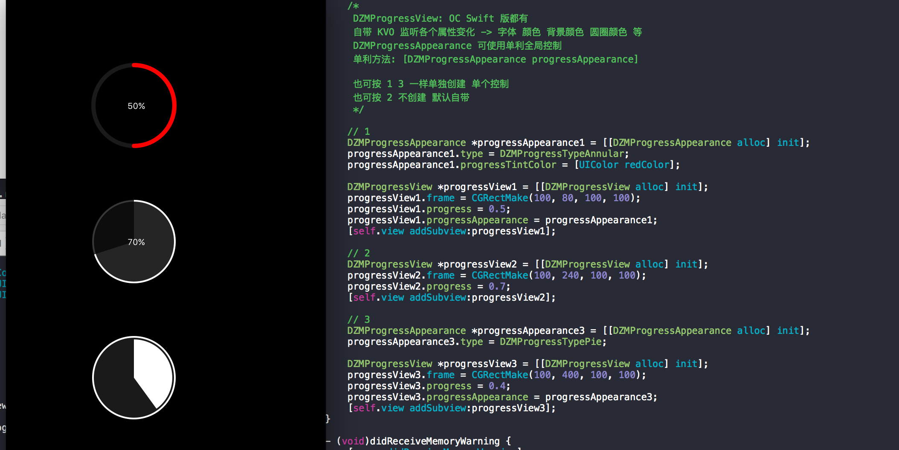

# DZMProgressView-OC

OC 版本 进度条 自带 KVO 监听各个属性变化 -> 字体 颜色 背景颜色 圆圈颜色 等

下面有使用方式

/*

DZMProgressView: OC Swift 版都有

自带 KVO 监听各个属性变化 -> 字体 颜色 背景颜色 圆圈颜色 等

DZMProgressAppearance 可使用单利全局控制

单利方法: [DZMProgressAppearance progressAppearance]

也可按 1 3 一样单独创建 单个控制

也可按 2 不创建 默认自带

*/

// 1

DZMProgressAppearance *progressAppearance1 = [[DZMProgressAppearance alloc] init];

progressAppearance1.type = DZMProgressTypeAnnular;

progressAppearance1.progressTintColor = [UIColor redColor];

DZMProgressView *progressView1 = [[DZMProgressView alloc] init];

progressView1.frame = CGRectMake(100, 80, 100, 100);

progressView1.progress = 0.5;

progressView1.progressAppearance = progressAppearance1;

[self.view addSubview:progressView1];

self.progressView1 = progressView1;

// 2

DZMProgressView *progressView2 = [[DZMProgressView alloc] init];

progressView2.frame = CGRectMake(100, 240, 100, 100);

progressView2.progress = 0.7;

[self.view addSubview:progressView2];

// 3

DZMProgressAppearance *progressAppearance3 = [[DZMProgressAppearance alloc] init];

progressAppearance3.type = DZMProgressTypePie;

DZMProgressView *progressView3 = [[DZMProgressView alloc] init];

progressView3.frame = CGRectMake(100, 400, 100, 100);

progressView3.progress = 0.4;

progressView3.progressAppearance = progressAppearance3;

[self.view addSubview:progressView3];